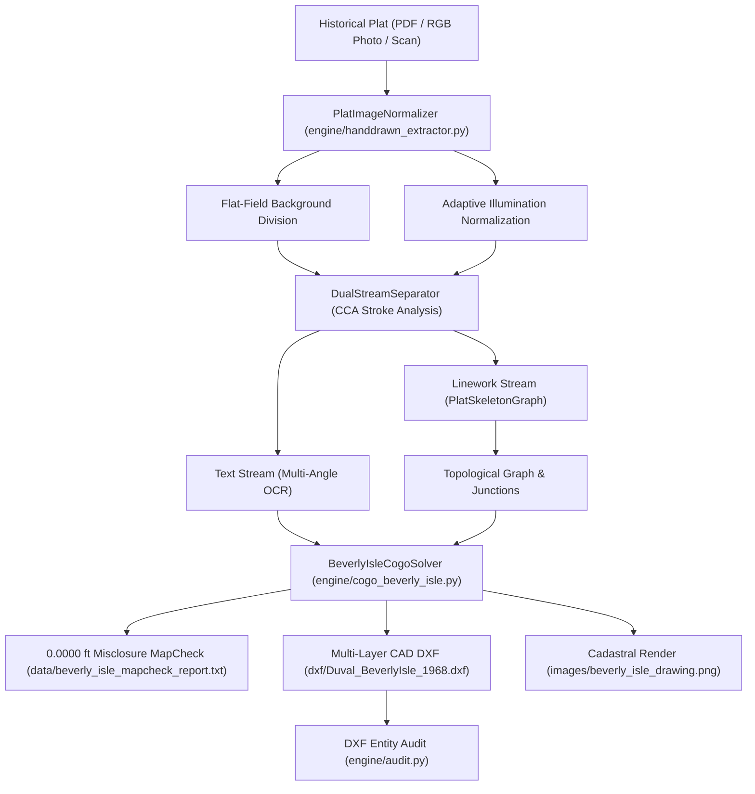

# Hand-Drawn Plat Reconstruction & Beverly Isle Cadastral Workflow

## 1. Overview & Context

Historical land subdivision plats drafted by hand (such as **Island No. 5 / Beverly Isle**, Section 24, Township 1 South, Range 27 East, Duval County, FL, surveyed in 1959–1960 by John F. Young & Associates) present unique challenges that standard modern vectorizers and flat OCR engines cannot handle:

1. **Photographic & Aging Artifacts**: Rather than clean flatbed bi-tonal scans, many older records exist only as 24-bit RGB photographs of weathered paper with amber cellophane tape stains, creases, shadows, and severe vignette lighting gradients.
2. **Dual-Stream Contention**: Ink text annotations (bearings, distances, lot numbers) overlap or touch parcel boundary lines, causing standard thresholding to fuse characters into line geometry.
3. **Curvilinear & Radial Layouts**: Islands and cul-de-sacs often feature central curvilinear access road corridors with radial property lines converging from a waterfront or marsh perimeter.
4. **The "Skeleton != Cadastre" Law**: Centerline thinning (morphological skeletonization) extracts the raster topological connectivity graph, but pixel-space coordinates are noisy ($\pm 2\text{ to }5\text{ ft}$ distortion). Final certified surveyor boundaries **must be solved analytically using Coordinate Geometry (COGO)** constrained by stated bearings, curve table parameters, and closure mathematics.

---

## 2. Standard Processing Pipeline

The Beverly Isle pipeline implements an end-to-end deterministic workflow across five core modules:



---

## 3. Key Components & Implementation Details

### Step 1: Universal Illumination Normalization (`engine/handdrawn_extractor.py:PlatImageNormalizer`)
- **RGB vs. Monochrome Auto-Detection**:
  ```python
  from engine.handdrawn_extractor import PlatImageNormalizer

  normalizer = PlatImageNormalizer()
  # Auto-detects whether the image is 24-bit photographic RGB or clean monochrome scan:
  norm_gray, is_rgb = normalizer.normalize(image_path)
  ```
- **Flat-Field Division**:
  Photographic lighting gradients and yellowed amber tape are removed by estimating the low-frequency illumination field via a large Gaussian blur kernel ($\sigma \approx 51$) and dividing the raw image by the background:
  $$I_{\text{norm}}(x, y) = \min\left(255, \frac{I(x, y)}{\text{Gaussian}(I(x, y))} \times 255\right)$$
  This equalizes contrast across the entire sheet so faint pencil/pen strokes in shadowed corners match well-lit areas.

---

### Step 2: Dual-Stream CCA Separation (`engine/handdrawn_extractor.py:DualStreamSeparator`)
- Standard global Otsu binarization merges text and lines. Instead, use Connected Component Analysis (CCA) on the inverted binary mask:
  - **Linework Mask**: Components with bounding-box diagonal $> 80\text{ px}$ or perimeter/area ratio indicative of elongated line strokes.
  - **Text Callout Mask**: Compact components ($8 \le \text{height} \le 65\text{ px}$, area $< 1200\text{ px}^2$) isolated for OCR.
- **Morphological Gap Healing**: Apply directional line-closing kernels to bridge tiny breaks caused by aged ink without bleeding into text callouts.

---

### Step 3: Centerline Skeletonization Graph (`engine/handdrawn_extractor.py:PlatSkeletonGraph`)
- Run Guo-Hall / Zhang-Suen morphological thinning on the linework mask to reduce multi-pixel ink strokes down to exact 1-pixel wide centerlines:
  ```python
  from engine.handdrawn_extractor import PlatSkeletonGraph

  skel_tool = PlatSkeletonGraph()
  skeleton = skel_tool.skeletonize(linework_mask)
  junctions, endpoints = skel_tool.find_nodes(skeleton)
  ```
- Identify topological nodes:
  - **Endpoints**: Degree = 1 (tie lines, open bounds)
  - **Regular Line**: Degree = 2
  - **Junctions / Lot Corners**: Degree $\ge 3$ (where lot lines meet right-of-way or rear boundary lines)

---

### Step 4: The Golden Rule — Skeleton vs. Analytical COGO
> [!IMPORTANT]
> **DO NOT** vectorize the raw skeleton pixel coordinates directly into the final CAD DXF.
> - Hand-drawn plat lines wander by several pixels (equal to 2–5 ft on a 1"=50' plat).
> - Tracing skeleton pixels produces non-closed polylines and non-zero misclosures violating Florida Administrative Code (F.A.C.) 5J-17.
> - **Correct Protocol**: Use the skeleton to discover the topological graph (which lot shares which edge with which neighbor), then solve the coordinate geometry deterministically using `BeverlyIsleCogoSolver` from stated bearings, distances, and curve parameters.

---

### Step 5: Radial Subdivision & Teardrop Loop COGO (`engine/cogo_beverly_isle.py`)
Beverly Isle features a classic hand-drawn island road network:
1. **GPS Control & Bridge Alignment**:
   - Tied to Heckscher Drive and the timber approach bridge at `30.407420° N, 81.442180° W`.
   - 10-foot dirt access road centerline runs $S 02^\circ 11' 20" W - 544.44'$.
2. **Deflection Curve $a$**:
   - Deflects the bridge approach into the island entrance:
     $$R = 97.37', \quad T = 30.00', \quad \Delta = 34^\circ 15' 00"$$
   - Tangent extends $S 52^\circ 20' 00" W - 245.00'$.
3. **Teardrop Road Loop & Central Parcel 20**:
   - Road splits into a 20' wide loop enclosing central Parcel 20.
   - **Curve $b$**: $R = 35.10', T = 59.00', \Delta = 118^\circ 30' 00"$
   - **Curve $c$**: $R = 50.11', T = 197.32', \Delta = 151^\circ 30' 00"$
4. **Radial Waterfront Parcels (Lots 1–19)**:
   - Radial division lines extend outward from the road loop to the Mean High Water / marsh perimeter.
   - All 20 parcels solve with **$0.0000\text{ ft}$ linear misclosure** (`EXACT`).

---

## 4. Verification, Auditing & Reproduction

### Re-running the Full Beverly Isle Pipeline
To execute illumination normalization, skeletonization, COGO solving, DXF generation, and visual plotting:
```bash
python3 scripts/build_beverly_isle.py
```

### Running Automated Test Suite
To verify mathematical closure, curve geometry, and CAD entity audits:
```bash
pytest test_beverly_isle_cogo.py -v
```

### CAD DXF Verification Standards
All generated DXFs must pass the automated CAD audit (`engine/audit.py:dxf_audit`):
- Layer separation:
  - `C-PROP-LINE`: Closed cadastral parcel boundaries (`LWPOLYLINE`)
  - `C-ROAD-CNTR`: Road centerlines (`DASHED`)
  - `C-ROAD-ROW`: Right-of-way lines
  - `C-PROP-CURV`: True circular arcs (`ARC`)
  - `C-PROP-LOTN`: Text entity lot labels (`TEXT`)
  - `C-TABL-DATA`: Embedded surveyor curve data tables
  - `CONTROL`: GPS ground control ties (WGS84)
- **Zero Noise Circles**: Ensure no false monument circles or stray circular pixel artifacts exist in the final CAD DXF.

---

## 5. Summary Checklist for Similar Historical Plats

When presented with another photographed or hand-drawn plat:
1. [ ] Check if the source is an RGB photograph vs clean scan (`PlatImageNormalizer.normalize`).
2. [ ] Apply flat-field division to remove tape stains, yellowing, and shadows.
3. [ ] Separate text from linework using CCA before running OCR.
4. [ ] Extract the centerline skeleton to identify road centerline alignment and junction points.
5. [ ] Solve the geometry analytically via COGO (`0.0000 ft` misclosure required).
6. [ ] Embed the official curve table and line table into both the ASCII MapCheck report and the CAD DXF.
7. [ ] Run `dxf_audit()` to guarantee zero CAD noise artifacts.
