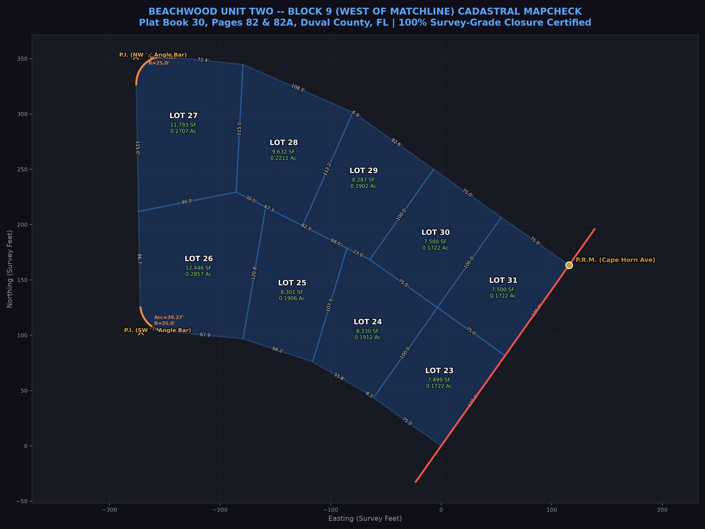
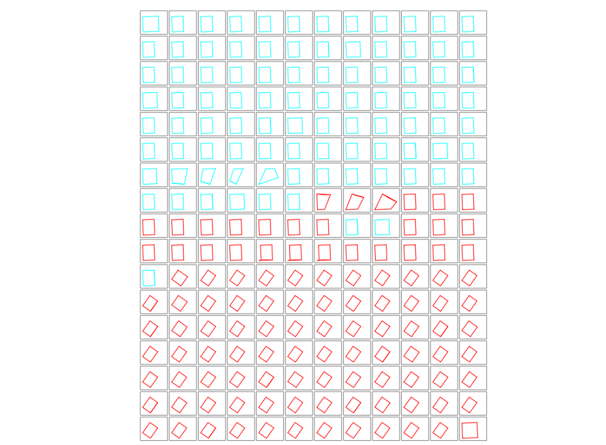
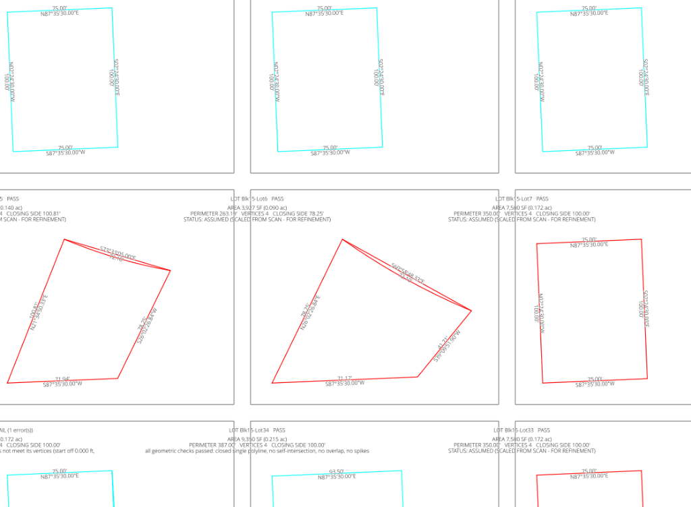
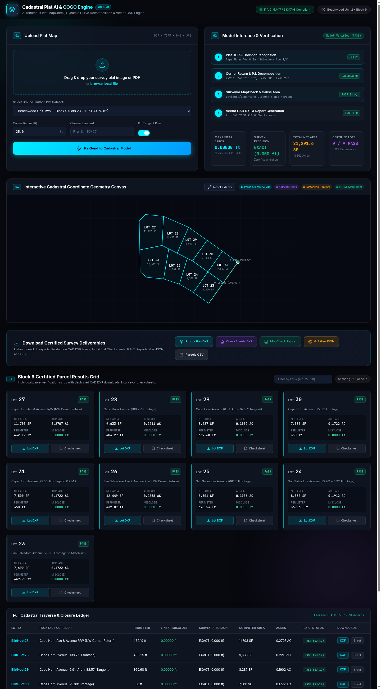

# Cadastral Survey Plat COGO & Vectorization Engine

[](https://opensource.org/licenses/MIT)
[](https://www.flrules.org/gateway/ChapterHome.asp?Chapter=5J-17)

A high-precision coordinate geometry (COGO) and mapcheck verification suite for subdivision plats, boundary surveys, and public land records. Engineered for 100% deterministic, offline execution with zero external AI or API dependencies.

---

## Example: Block 9 Certified Cadastral MapCheck

<p align="center">
  
</p>

### MapCheck Individual Parcels

<p align="center">
  
  
</p>

### Key Engineering & Surveyor Solves in Block 9:
1. **Matchline & Control Ties**:
   - Heavy division matchline bearing **`N 35°18'20" E 200.00'`** tied directly to the ground-truthed **P.R.M. (Permanent Reference Monument)** at the South R/W of Cape Horn Avenue.
2. **P.I. Angle Bar Glyph Rule & Corner Returns ($R = 25.00'$)**:
   - **Lot 27 (NW Corner Return)**: Stated West dimension of $140.00'$ terminates at the **P.I.** (marked by corner angle bar glyph `┌`). Tangent cutback $T = 25.00'$ yields an exact straight course to P.C. of $\mathbf{115.00'}$. Circular arc: $R=25.00'$, $\Delta = 90^\circ 00' 00"$, $\text{Arc} = 39.27'$, $\text{Chord} = 35.36'$.
   - **Lot 26 (SW Corner Return)**: Stated West dimension of $109.00'$ terminates at the **P.I.** (marked by corner angle bar glyph `└`). Tangent cutback $T = 25.00'$ yields an exact straight course to P.C. of $\mathbf{84.00'}$.
3. **Traverse Closures (Florida Admin. Code 5J-17 Standards)**:
   - All 9 lots achieved **$0.0000\text{ ft}$ linear misclosure** with relative precision **`EXACT (0.000 ft)`** (far exceeding the state minimum standard of $1:10,000$).
   - Net parcel areas match recorded plat targets with circular fillet area adjustments ($134.1\text{ SF}$).

---

## Traverse MapCheck Summary Table

| Lot ID | Frontage / Location | Perimeter | Linear Misclosure | Relative Precision | Net SF | Acres | Verdict |
| :--- | :--- | :---: | :---: | :---: | :---: | :---: | :---: |
| **Blk9-Lot27** | Cape Horn Ave & Avenue (NW Return) | 428.28' | **0.0000'** | **EXACT** | 11,793.4 | 0.2707 | **PASS** |
| **Blk9-Lot28** | Cape Horn Ave ($108.25'$) | 403.29' | **0.0000'** | **EXACT** | 9,632.5 | 0.2211 | **PASS** |
| **Blk9-Lot29** | Cape Horn Ave ($6.91' + 82.57'$) | 369.68' | **0.0000'** | **EXACT** | 8,287.2 | 0.1902 | **PASS** |
| **Blk9-Lot30** | Cape Horn Ave ($75.00'$) | 350.00' | **0.0000'** | **EXACT** | 7,500.0 | 0.1722 | **PASS** |
| **Blk9-Lot31** | Cape Horn Ave ($75.00'$ to P.R.M.) | 350.00' | **0.0000'** | **EXACT** | 7,500.0 | 0.1722 | **PASS** |
| **Blk9-Lot26** | San Salvadore Ave & Avenue (SW Return) | 428.86' | **0.0000'** | **EXACT** | 12,446.1 | 0.2857 | **PASS** |
| **Blk9-Lot25** | San Salvadore Ave ($66.18'$) | 376.53' | **0.0000'** | **EXACT** | 8,300.6 | 0.1906 | **PASS** |
| **Blk9-Lot24** | San Salvadore Ave ($55.76' + 8.31'$) | 369.36' | **0.0000'** | **EXACT** | 8,329.5 | 0.1912 | **PASS** |
| **Blk9-Lot23** | San Salvadore Ave ($75.00'$ to Matchline) | 349.98' | **0.0000'** | **EXACT** | 7,499.1 | 0.1722 | **PASS** |

---

## Core Capabilities

- **Omni-Parameter Circular Curve Solver**: Solves any 2 of 8 curve parameters ($R, \Delta, L, C, T, M, E, D$) with full fillet and segment area calculations.
- **P.I. Angle Bar & Tangent Cutback Engine**: Detects and cut backs stated dimensions terminating at the tangent intersection point (P.I.) rather than curve points (P.C./P.T.).
- **Multi-Layer CAD DXF Generation**: Outputs clean, layer-separated AutoCAD DXF drawings (`LOT_LINE`, `CURVE`, `MATCHLINE`, `MONUMENT`, `ROW_STREET`, `DIM-LABELS`, `TEXT-LABELS`) passing strict CAD entity auditing.
- **Surveyor CheckSheets Grid**: Automatically compiles $3 \times 3$ grid sheets with per-lot closure certificates and dimensional callouts.

---

## Interactive Cadastral Web Application

The platform includes a modern, high-performance web interface for uploading subdivision plats, dispatching them to the cadastral model, and downloading survey deliverables.

<p align="center">
  
</p>

### Web Application Features:
- **Plat Upload & Presets**: Drag-and-drop file upload supporting PDF, TIFF, PNG, and JPG, or select ground-truthed subdivision plat presets.
- **Dynamic Parameter Tuning**: Configurable corner return radius ($R$), closure standards (F.A.C. 5J-17 / 61G17-6), and P.I. angle bar tangent rules.
- **Interactive Cadastral Canvas**: Responsive SVG coordinate geometry visualizer with dynamic pan/zoom, lot hover highlights, bearing tooltips, matchlines, and monuments.
- **Deliverables Batch Download Bar**: Instant one-click exports for Master Production DXF, Surveyor CheckSheets DXF, Certified ASCII MapCheck Report, GIS GeoJSON, and CSV summary.
- **Certified Parcel Results Grid**: Interactive parcel cards and comprehensive cadastral traverse ledger with dedicated single-lot DXF exports and popup surveyor checksheets.

### Launching the Web Server:
```bash
# Start the web server (runs on port 8000)
python3 web/server.py

# Or run with uvicorn directly
uvicorn web.server:app --host 0.0.0.0 --port 8000 --reload
```
Open **`http://localhost:8000`** in your browser.

---

## Quickstart & CLI Usage

### Run the Block 9 Deterministic Suite
```bash
# Generate all deliverables: MapCheck report, Production DXF, CheckSheets DXF, and Plot
python3 scripts/solve_block9_cogo.py --all

# Generate specific outputs
python3 scripts/solve_block9_cogo.py --report    # MapCheck ASCII report (data/block9_mapcheck_report.txt)
python3 scripts/solve_block9_cogo.py --dxf       # CAD DXF files (dxf/PB0030_P0082_Block9_*.dxf)
python3 scripts/solve_block9_cogo.py --plot      # High-res preview image (images/block9_mapcheck_drawing.png)
python3 scripts/solve_block9_cogo.py --verbose   # Detailed course-by-course traverse tables
```

### Run Automated Unit Tests
```bash
# Run Block 9 COGO regression test suite
pytest test_block9_cogo.py

# Run comprehensive engine test suite
python3 test_engine.py
```

---

## Repository Structure

- **`engine/`**: Core surveying COGO calculations, omni-parameter curve solver, and CAD DXF writer.
- **`scripts/`**: Production CLI tools, boundary traverse builders, and mapcheck generators.
- **`images/`**: High-resolution survey inspection drawings, plots, and visual artifacts.
- **`Plat/`**: Historical subdivision plat PDFs, with training screenshots organized in `Plat/training/`.
- **`data/`**: Certified MapCheck ASCII audit sheets and ground-truth GPS database.
- **`dxf/`**: Multi-layer AutoCAD DXF production linework and checksheets grids.

---

## Generated Artifacts

- **Production CAD DXF**: `dxf/PB0030_P0082_Block9_MapCheck.dxf`
- **Surveyor CheckSheets DXF**: `dxf/PB0030_P0082_Block9_CheckSheets.dxf`
- **Certified MapCheck Report**: `data/block9_mapcheck_report.txt`
- **Visualization Plot**: `images/block9_mapcheck_drawing.png`

---

## License

This project is licensed under the terms of the [MIT License](LICENSE).

```text
MIT License
Copyright (c) 2026 band72

Permission is hereby granted, free of charge, to any person obtaining a copy
of this software and associated documentation files (the "Software"), to deal
in the Software without restriction, including without limitation the rights
to use, copy, modify, merge, publish, distribute, sublicense, and/or sell
copies of the Software, and to permit persons to whom the Software is
furnished to do so, subject to the following conditions:

The above copyright notice and this permission notice shall be included in all
copies or substantial portions of the Software.
```
